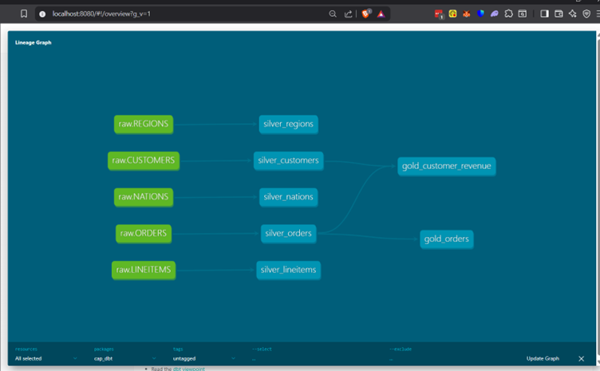
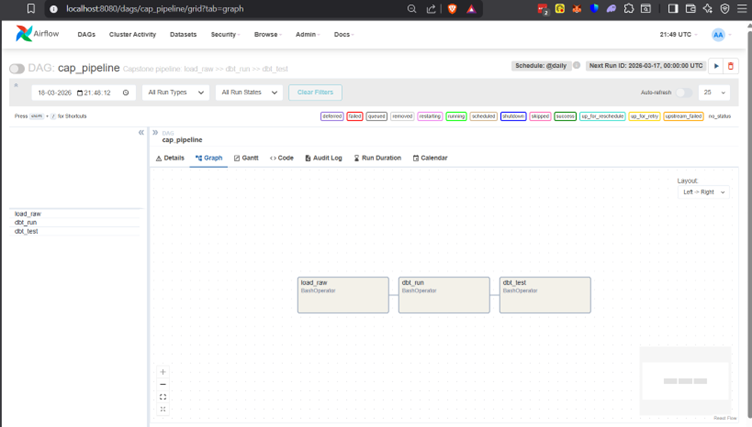
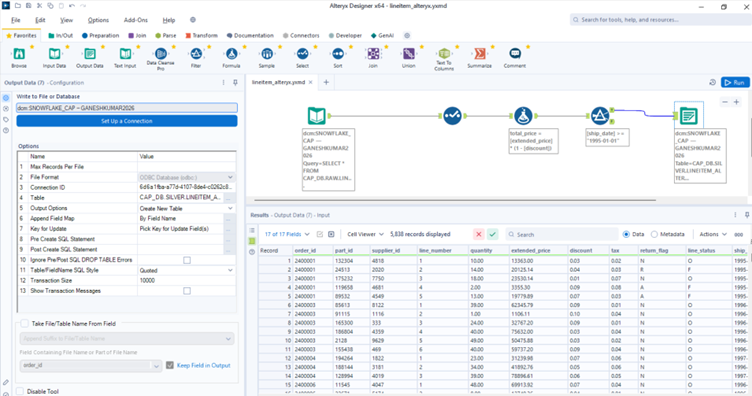
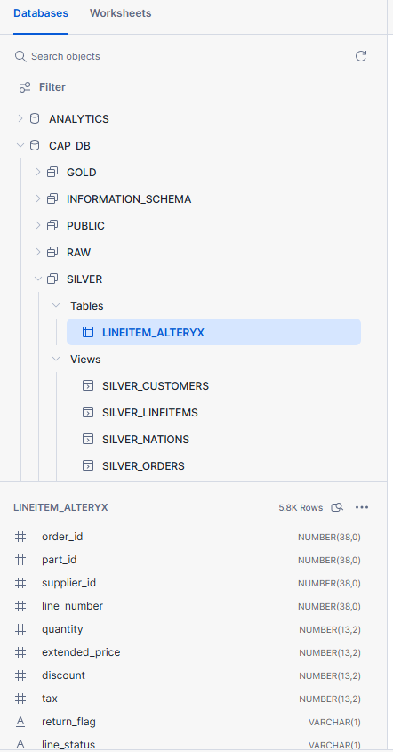

# Capstone: End-to-End Data Pipeline

End-to-end data pipeline with Snowflake, dbt, Airflow & Alteryx

## Architecture
AWS S3 → Snowflake RAW → dbt SILVER → dbt GOLD → Airflow Orchestration → Alteryx ETL

## Tech Stack
- **Snowflake** — Cloud Data Warehouse (RAW, SILVER, GOLD schemas)
- **dbt Core** — Data transformations and testing
- **Airflow** — Pipeline orchestration via Docker
- **Alteryx** — Hybrid ETL transformation

## Project Structure
- `cap_dbt/` — dbt models, tests, macros
- `cap_airflow/` — Airflow DAG
- `cap_alteryx/` — Alteryx workflow (.yxmd)
- `docs/` — Screenshots and documentation

## Documentation
[Notion Page](https://www.notion.so/Capstone-End-to-End-Data-Pipeline-3287f1254e9c80f09888dd5d1492597d?source=copy_link)

## dbt Lineage

## Airflow DAG

## Alteryx Workflow

## Snowflake Structure
