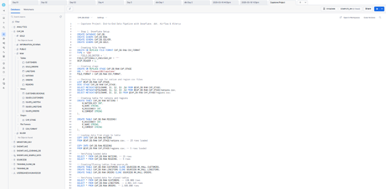

# Capstone: End-to-End Data Pipeline

## Architecture
AWS S3 → Snowflake (RAW) → dbt (SILVER/GOLD) → Airflow (Orchestration) → Alteryx (Transformation)

## Tech Stack
- **Snowflake** — Cloud Data Warehouse (RAW, SILVER, GOLD schemas)
- **dbt Core** — Data transformations and testing
- **Airflow** — Pipeline orchestration via Docker
- **Alteryx** — Hybrid ETL transformation

## Project Structure
```
capstone-data-pipeline/
  cap_dbt/        → dbt models, tests, macros
  cap_airflow/    → Airflow DAG
  cap_alteryx/    → Alteryx workflow (.yxmd)
  docs/           → Screenshots and documentation
```

## Snowflake Structure



## dbt Lineage


## Airflow DAG


## Pipeline Flow
load_raw >> dbt_run >> dbt_test